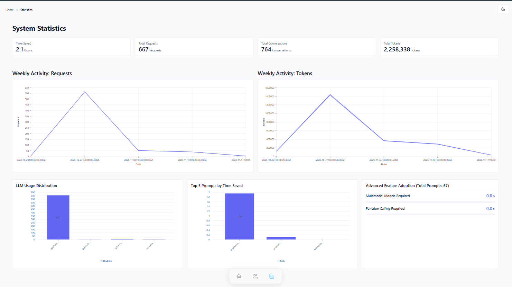

# Global Statistics

The **Statistics** page provides a high-level overview of your system's health, usage trends, and Return on Investment (ROI).

## Global Metrics

Real-time counters provide an instant view of the organization's total consumption:

- **Total Requests:** The aggregate number of interactions processed.
- **Total Conversations:** The count of unique conversation threads.
- **Total Tokens:** The sum of all Input and Output tokens consumed.
- **Total Time Saved:** The cumulative estimated hours saved, calculated based on the ROI settings of utilized prompts.

## Usage Trends

- **Weekly Activity:** Time-series charts displaying the volume of requests and token consumption over the last 7 days.
- **LLM Usage Distribution:** A breakdown of which AI models (e.g., GPT-4o, Claude 3.5) are being utilized the most.

## Value & Adoption

- **Top 5 Prompts by Time Saved:** A ranking of the most valuable prompts in terms of productivity gains.
- **Advanced Feature Adoption:** Visualizes the usage rate of specialized capabilities, specifically **Function Calling** and **Multi-Modal** inputs.
