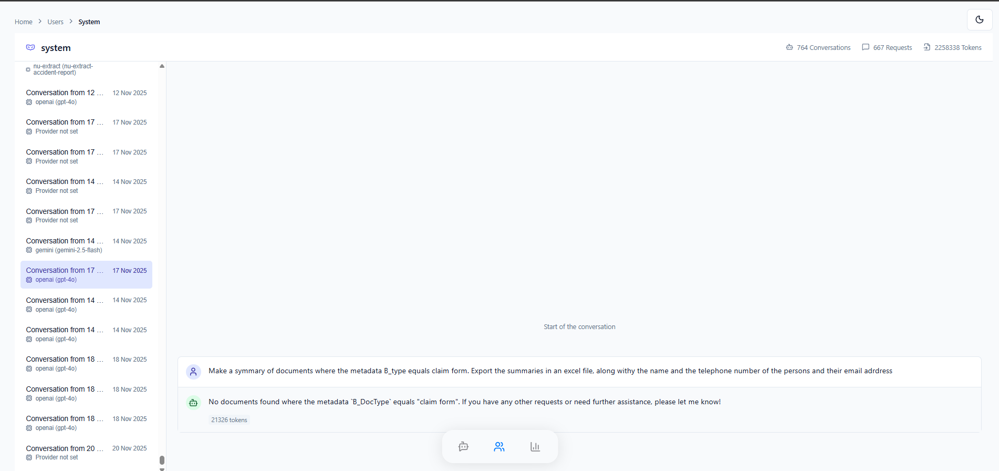

# User Management

The User Management section allows administrators to monitor activity at the user level to understand adoption patterns and usage intensity.

## User List

The **User List** provides a tabular view of all users who have interacted with the system.

**Available Metrics:**

- **Conversation Count:** The number of sessions created by the user.
- **Token Usage:** The total Input and Output tokens consumed.
- **Request Count:** The total number of individual interactions.

## User Details

Clicking on a specific user navigates to the **User Details** view for a granular look at their history.

### Features

- **Summary Stats:** Recaps the user's total consumption and activity metrics.
- **History Access:** Administrators can view the full list of **Conversations** and specific **Requests** made by the user. This feature is essential for support troubleshooting and auditing purposes.
