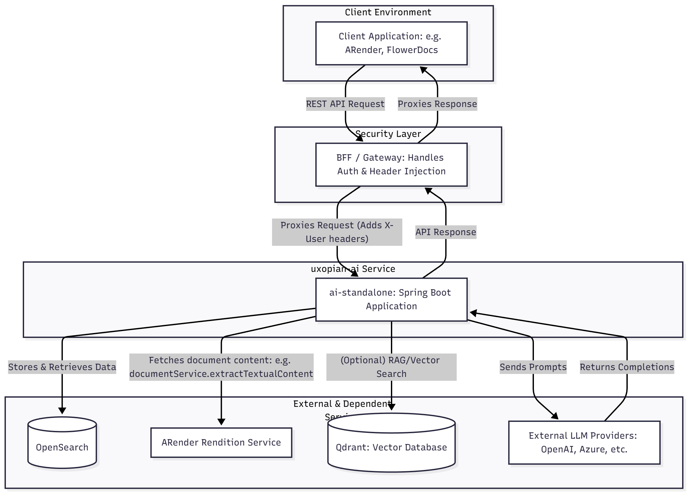
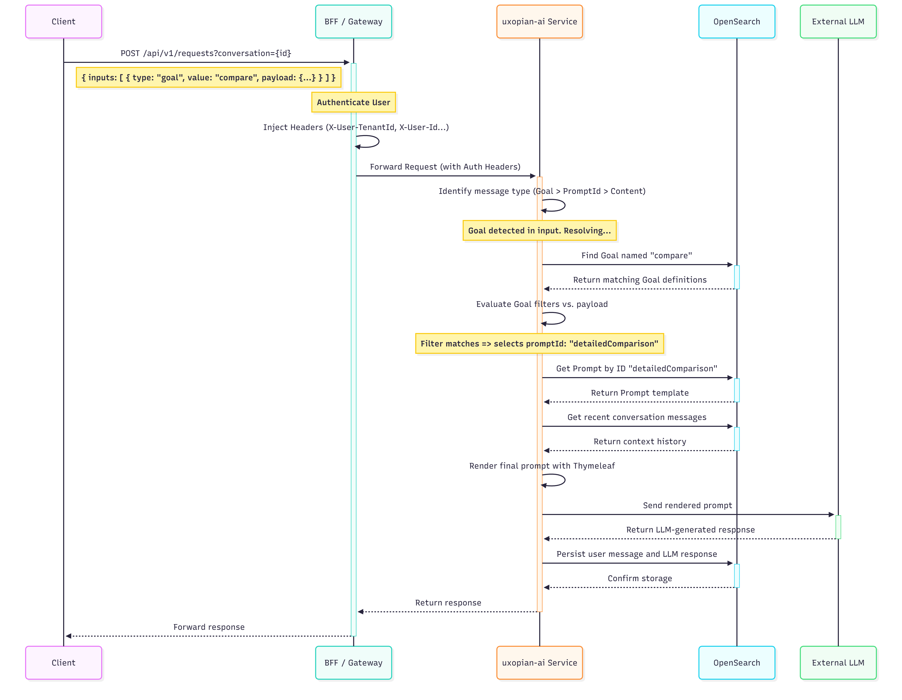

This section provides insight into the framework's design, covering both the high-level components and the software-level interactions.

---

## Component Architecture

This section provides insight into the framework's design, covering both the high-level components and the software-level interactions, specifically highlighting the security integration via the BFF pattern.

The **uxopian-ai** framework is designed as a backend microservice that sits behind a security gateway. It is composed of several key components working in concert.

### Component Descriptions

**Client Application**
User-facing application (e.g., **ARender**, **FlowerDocs**) that initiates requests.
It never communicates directly with **uxopian-ai**.

**BFF / Gateway (Security Layer)**
Entry point for all traffic. The Gateway is a **standalone, independently deployed service** built on **Spring Cloud Gateway** (reactive) with a pluggable auth provider system. Responsible for:

- **Authenticating** the user via a pluggable provider (OAuth2, JWT, LDAP, or the `DevProvider` for development)
- **Enriching** requests with identity headers (`X-User-TenantId`, `X-User-Id`, `X-User-Roles`, `X-User-Token`)
- **Enforcing** role-based access control (e.g., admin-only paths)
- **Proxying** the request to the backend service

The Gateway processes each request through a filter pipeline: `DefaultProviderHeaderFilter` (route matching) → `AuthFilter` (authentication + header injection) → Spring Cloud Gateway (routing). See [Security Model](security.md) for the full pipeline details and provider reference.

**uxopian-ai Service**
The core of the framework. This standalone Java application:

- Exposes the REST API (consumed by the BFF)
- Manages conversations and messages per Tenant ID
- Resolves Goals and Prompts via the templating engine
- Connects to external LLM providers using the `llm-clients` module

**OpenSearch**
Primary data store for:

- Conversations
- Messages
- Prompts
- Goals

**ARender Rendition Service**
External service used to fetch document content (e.g., extracting text).

**Qdrant**
Optional vector database enabling RAG (Retrieval-Augmented Generation).

**External LLM Providers**
Third-party services (OpenAI, Azure, etc.) handling natural language processing.

---

## Software Architecture (Request Flow)

To understand how the components interact, here is the lifecycle of a typical API call: sending a message that triggers a Goal.

The request flow emphasizes the role of the **BFF** in establishing the security context before the service logic executes.

### Sequence Diagram: Executing a Goal

## 

## Workflow Steps

1. **Client Request**
   Client sends a request to the BFF (e.g., `POST /api/v1/requests`) with a goal input such as `"compare"`.

2. **Authentication & Injection**
   The BFF authenticates, then injects `X-User-TenantId`, `X-User-Id`, etc.

3. **Context Establishment**
   uxopian-ai reads the headers to derive the security context.

4. **Goal Resolution**
   The service queries OpenSearch for Goals matching `"compare"` in the tenant.

5. **Filter Evaluation**
   SpEL filters narrow the choice to a specific `promptId` (e.g., `"detailedComparison"`).

6. **Prompt & Context Retrieval**
   The Prompt definition and conversation history are loaded.

7. **Template Rendering**
   Thymeleaf produces the final LLM prompt, optionally pulling external content.

8. **LLM Interaction**
   The prompt is sent to the configured LLM provider.

9. **Persistence**
   User message and LLM response are saved in OpenSearch.

10. **Response**
    The final response is returned through the BFF to the client.
